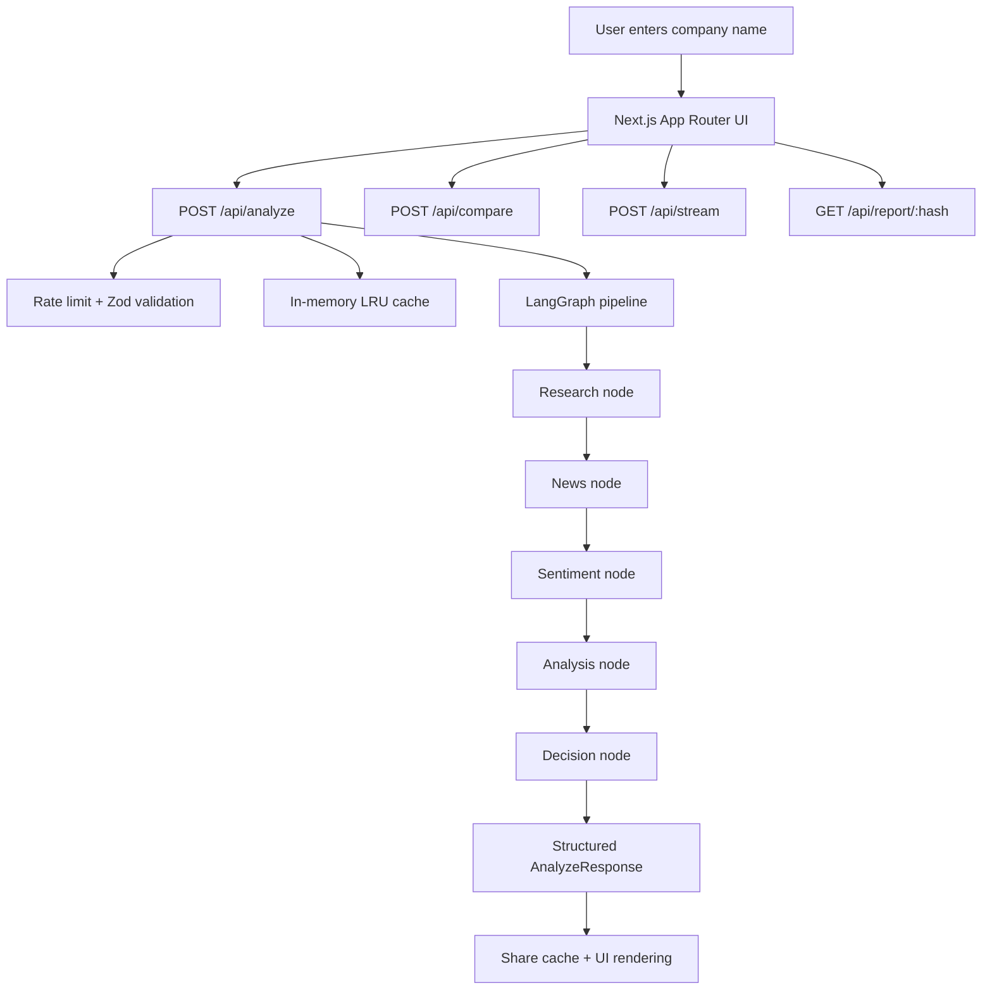

#Link :- equitylens-ashy.vercel.app
# AI Investment Research Agent

An AI-powered investment research app that takes a company name, gathers market and news context, and returns an INVEST or PASS recommendation with the reasoning behind it.

Built with Next.js, LangGraph.js, and Google Gemini. The app also supports side-by-side company comparison, cached share links, a local watchlist, and streamed reasoning.

## Overview

The app lets a user enter a company name such as Apple, Reliance Industries, or Microsoft. Behind the scenes it:

1. Resolves the company to a tradable ticker when possible.
2. Pulls live financial data from Yahoo Finance.
3. Fetches recent news from NewsAPI, or synthesizes relevant news when that source is unavailable.
4. Runs a 5-node LangGraph pipeline to produce a structured investment report.
5. Validates the output, adds sector benchmarking, and returns the final report to the UI.

What the user sees:

- Investment score from 0 to 100
- INVEST or PASS recommendation
- Overview, strengths, risks, and reasoning
- Financial profile with market cap, P/E, EPS, dividend yield, margins, and more
- Recent news with sentiment labels
- Sector benchmark when the sector can be mapped
- Shareable report links and a local watchlist
- Comparison mode for analyzing two companies side-by-side

## How to Run It

### Prerequisites

- Node.js 18 or newer
- npm 9 or newer
- A Google Gemini API key
- Optional: a NewsAPI key for live news retrieval

### Install

```bash
npm install
```

### Environment variables

Create a `.env.local` file in the project root:

```env
GEMINI_API_KEY=your_gemini_api_key_here
NEWS_API_KEY=your_newsapi_key_here
```

`GEMINI_API_KEY` is required for the research pipeline. `NEWS_API_KEY` is optional, but without it the app falls back to AI-synthesized news items.

### Run locally

```bash
npm run dev
```


### Production build

```bash
npm run build
npm start
```

### Lint

```bash
npm run lint
```

## How It Works

### Architecture



### Pipeline

The research flow is defined in [agents/investmentGraph.ts](agents/investmentGraph.ts) and runs these stages:

1. Research node: resolves the company name, uses Yahoo Finance tool calls to gather quote and profile data, and prepares the analysis prompt.
2. News node: fetches recent articles from NewsAPI and falls back to AI-synthesized news when needed.
3. Sentiment node: classifies news articles or generates realistic news items if the news source was empty.
4. Analysis node: sends the prompt to Gemini and requests a structured JSON investment report.
5. Decision node: parses and validates the JSON, clamps the score, infers a safe recommendation when needed, adds financial profile data, sector benchmarking, and metadata.

### API routes

- `POST /api/analyze` runs one company through the pipeline.
- `POST /api/compare` runs two analyses in parallel and returns the winner plus score delta.
- `POST /api/stream` streams a reasoning draft over Server-Sent Events.
- `GET /api/report/:hash` retrieves a cached shared report for the link generated after analysis.

### Data and caching

- Rate limiting is handled in-memory per IP.
- Analysis results are cached in an in-memory LRU cache with a 1-hour TTL.
- Shared report links are stored in an in-memory hash cache with a 1-hour TTL.
- Watchlist items are stored on the client side in `localStorage`.

## Key Decisions & Trade-offs

### LangGraph instead of one large prompt

The pipeline is split into focused nodes so each step can fail or fall back independently. That makes the system easier to debug and easier to extend later.

### Yahoo Finance for market data

The project uses `yahoo-finance2` because it is free, requires no account, and supports many exchanges. The trade-off is that it depends on an unofficial data source.

### NewsAPI with AI fallback

Live news is preferred when the API key is available. If it is missing or returns nothing, the system generates realistic news items so the report still feels complete.

### Gemini Flash and Pro by depth

Quick mode uses `gemini-2.5-flash` for speed. Deep mode prefers `gemini-2.5-pro`, with a flash fallback when rate limits are hit.

### Structured JSON output

The analysis node uses Gemini schema-based output so the response matches the app’s typed `AnalyzeResponse` shape. That avoids brittle string parsing and keeps the UI contract stable.

### In-memory caching instead of Redis

For a take-home project, in-memory caching keeps the deployment simple. The trade-off is that caches reset on restart and do not share across serverless instances.

### No auth layer

The app keeps the demo flow simple by avoiding sign-in. The watchlist is local to the browser, which is fine for an assignment but not ideal for a production product.

## Example Runs

These are sample runs you can include in the submission. Replace the values below with fresh outputs from your own test runs before sending the zip.

### Apple Inc. - Quick mode

```text
Company: Apple Inc.
Ticker: AAPL
Recommendation: INVEST
Score: 80+/100

Why:
- Strong ecosystem lock-in
- High-margin services revenue
- Large cash generation and balance sheet strength

Main risks:
- China exposure
- Regulatory pressure on platform fees
- Hardware growth cyclicality
```

### Reliance Industries - Deep mode

```text
Company: Reliance Industries Limited
Ticker: RELIANCE.NS
Recommendation: INVEST or PASS depending on current valuation and margin trend
Score: mid-60s to 70s

Why:
- Diversified business mix
- Strong domestic scale and distribution
- Optionality across energy, retail, and telecom

Main risks:
- Capital intensity
- Regulatory and commodity exposure
- Execution risk across multiple business lines
```

### Microsoft - Comparison mode example

```text
Company A: Microsoft
Company B: Alphabet
Winner: the company with the stronger score after valuation and growth are compared
Delta: score difference between the two reports
```

## What I Would Improve With More Time

- Add persistent storage so share links and watchlists survive server restarts.
- Replace in-memory rate limiting with a distributed limiter.
- Add a richer finance data source and deeper fundamentals coverage.
- Add charting for historical price and valuation trends.
- Add export options for PDF or markdown reports.
- Store LLM transcript logs from development sessions and link them directly in the submission.

## LLM Usage / Transcript Logs

AI usage is already part of the implementation through Gemini and LangGraph. If you want to maximize bonus points for the assignment, include your development chat logs or prompt transcripts in a separate folder and reference them here.

Suggested format:

- `docs/llm-logs/`
- `docs/llm-logs/session-01.md`
- `docs/llm-logs/session-02.md`

## Notes

- The app is optimized for a demo-style workflow, not a production brokerage tool.
- All market data and recommendations should be treated as informational, not financial advice.
